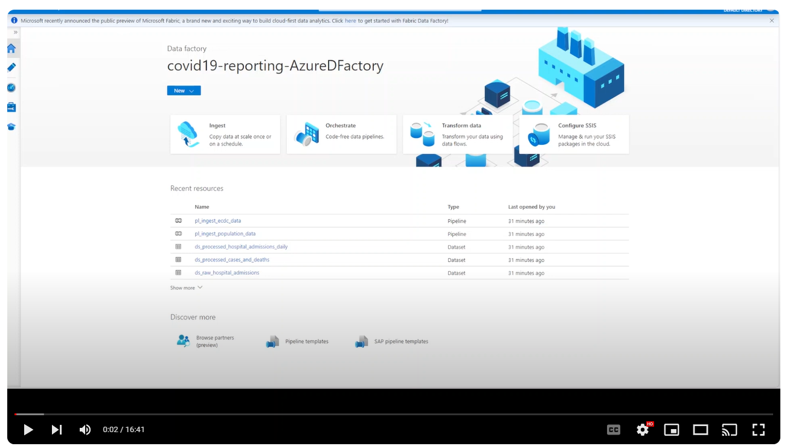

# DevOps

DevOps isn't just a buzzword — it represents the fusion of Development and Operations within the software development realm. It's not merely a set of tools but a cultural shift embedded in Agile Development methodologies, aimed at breaking down the silos between teams and technologies.

  
  

    Image courtesy of Atlassian (https://www.atlassian.com/devops/)
  

 Some of the benfits include:
* Collaboration
* Rapid Deployment and Release
* Increase in trust and transparency
* Automation

## Embracing Collaboration and Speed
Let's dive into the heart of DevOps with two compelling options:
### Option 1: Manual Build with Continuous Deployment (ADF Publish)
In this approach, developers wield control over the build process, triggering deployments through Azure Data Factory (ADF) Publish. While providing a semblance of control, this method might lengthen deployment cycles and heighten the risk of human error.

### Option 2: Automated Build (Continuous Integration) with Continuous Deployment
Embrace automation with this option. Continuous Integration (CI) automates build processes upon code changes, while Continuous Deployment (CD) ensures seamless deployment to target environments. Expect faster, error-free deployments.
* Automated Build

* Automated Release

### Git Configuration: The Backbone of Collaboration

We adopt an approach where we create feature branches for making edits and merge them into the main branch. The main branch serves as the collaborator branch, this is a simplified version of the recommended *Gitflow workflow*.This approach allows for parallel development efforts without disrupting the stability of the main codebase. Additionally, it facilitates code review and collaboration among team members through pull requests.

### Software Environments: Crafting Realistic Stages
It's essential to ensure that different software environments are established for isolation and to mimic various scopes, ensuring optimal software performance. 

 From Development to Production, our software environments mirror real-world scenarios:

- **Development Environment**: This environment is where developers work on new features and bug fixes. It should closely resemble the production environment to catch issues early in the development process.

- **Testing Environment**: The testing environment is used for testing new features and changes before they are deployed to production. It should mimic the production environment as closely as possible to ensure accurate testing results.

- **Production Environment**: The production environment is where the live application runs and serves end-users. It's crucial to maintain the stability and reliability of this environment to ensure uninterrupted service for users.

## Tools and Resources:
- [**Pre and Post Deployment Scripts**](./PrePostDeploymentScript.Ver2.ps1): Cleanse your data platform before resource creation. [Official documentation](https://learn.microsoft.com/en-us/azure/data-factory/continuous-integration-delivery-sample-script)
- [**Automated Deployment Documents**](https://learn.microsoft.com/en-us/azure/data-factory/continuous-integration-delivery-improvements): Dive into official documentation and YAML code for streamlined deployments.
    - [Package File](./package.json)
    - [existing YAML code](./adf-cicd-automated-build-pipeline.yml)

## Lessons Learned
Our journey in DevOps has been enriched by several key learnings:

- **Leveraging Azure DevOps**: Automate, streamline, and optimize with Azure DevOps.
- **Git Best Practices**: Navigate the Gitflow, fostering collaboration and stability.
- **Infrastructure as Code (IaC)**: Unleash the power of ARM Templates for consistent infrastructure deployment.
- **Security and Access Management**: Safeguard secrets and control access with Azure Key Vault and Managed Identities.

### Demo DevOps Video
Watch our captivating Demo DevOps Video for an immersive look into our practices and workflows.

## Helpful Links
- [To enable the Release option in Azure Devops Pipeline](https://www.youtube.com/watch?v=0UIp0ZdGWsY)
- [To grant access to the secret keys tab](https://stackoverflow.com/questions/69971341/unable-to-create-secrets-in-azure-key-vault-if-using-azure-role-based-access-con)
