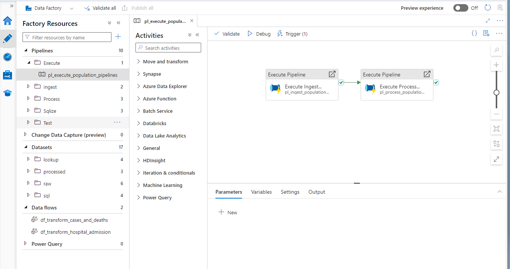

# Data Ingestion

Data ingestion involves gathering data from various sources and consolidating it into a centralized repository for further processing.

Sources:
- HTTP: Data is sourced directly from the ECDC website via HTTP requests.
- Blob Storage: Eurostats data is obtained from Azure Blob Storage.

## Demo
