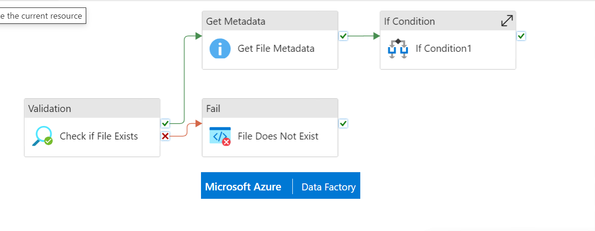
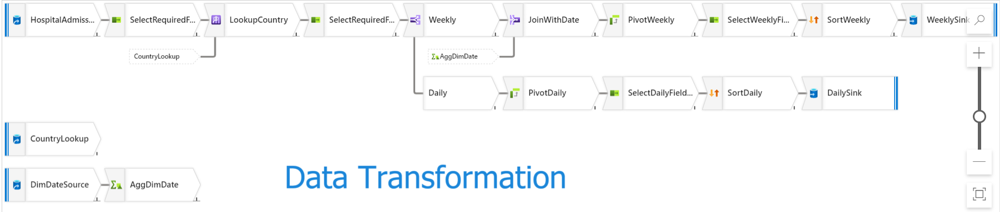
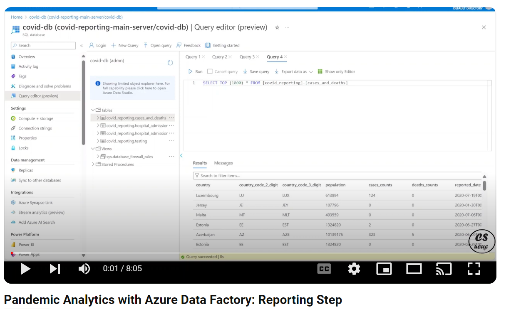
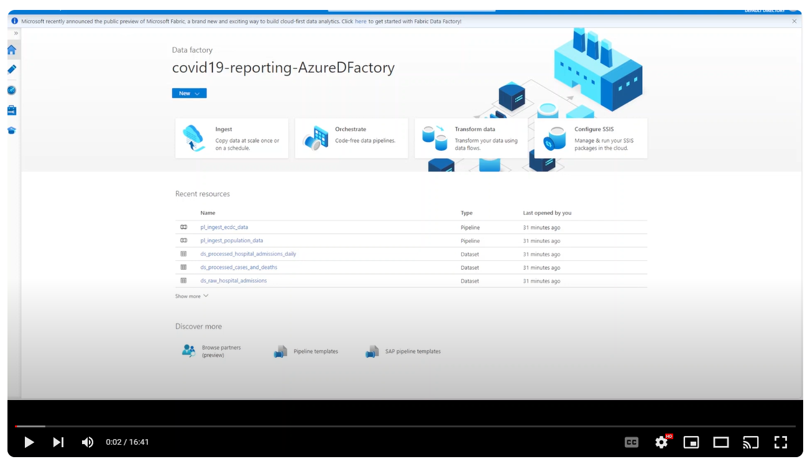

# Azure-Powered Insights: Unveiling COVID-19 Trends with Azure Data Factory

Azure Data Factory is a robust, fully managed Platform as a Service (PaaS) solution designed for Extract, Transform, Load (ETL) as well as Extract, Load, Transform (ELT) operations on data. It empowers users to efficiently orchestrate, automate, and manage the movement and transformation of data across various sources and destinations in the cloud.

This project focuses on addressing the pressing need for understanding the impact of COVID-19 on society by creating a robust end-to-end **data platform** for reporting and predicting COVID-19 outbreaks.

## Business Problem
Our organization seeks comprehensive insights into COVID-19, including historical data analysis on mortality rates and the spread of the virus. To achieve this, we aim to:

- Establish a data platform for reporting and predicting COVID-19 outbreaks.
- Create a Data Lake to aggregate data from authoritative sources such as ECDC and Eurostat.
- Utilize tools like Databricks, HDInsights, and Dataflows for data transformation.
- Ingest transformed data into the Data Lake to facilitate predictive analytics.
- Utilize a Data Warehouse to store data for trend analysis and reporting.
- Integrate disparate datasets seamlessly using Azure Data Factory.
- Implement Business Intelligence (BI) tools for analyzing trends and test effectiveness.
- Develop robust monitoring pipelines with alerting capabilities.

## Approach
Our approach encompasses several key phases:

1. [**Ingestion**](./Ingestion/README.md): Gathering data from multiple sources into a centralized repository.
2. [**Transformation**](./Transformation/README.md): Structuring and cleansing data using various Azure tools.
3. [**Preparation of Reporting Data**](./Reporting/README.md): Aggregating and formatting data for reporting and analysis.
4. [**Orchestration and Monitoring**](./Reporting/README.md): Managing data pipelines and ensuring operational efficiency.
5. [**Reporting Trends**](./Reporting/README.md): Utilizing Power BI to visualize and analyze trends in COVID-19 data.
6. [**DevOps**](./DevOps/README.md): Implementing Continuous Integration (CI) and Continuous Deployment (CD) practices for maintaining the solution.

### **Video Demos**
- Ingestion Video
 
- Transformation Video
 
- Reporting Video
 
- DevOps Video
 

## Tools Used
- Azure SQL Database
- Azure Blob Storage
- Azure Databricks
- Azure Data Factory
- Azure Data Lake Storage Gen2
- Azure HDInsights
- Power BI

## Artifacts
- ARM Template: Infrastructure as Code(IaC) for Azure environment setup.

## License
This project is licensed under the MIT License - see the [LICENSE](./LICENSE) file for details.