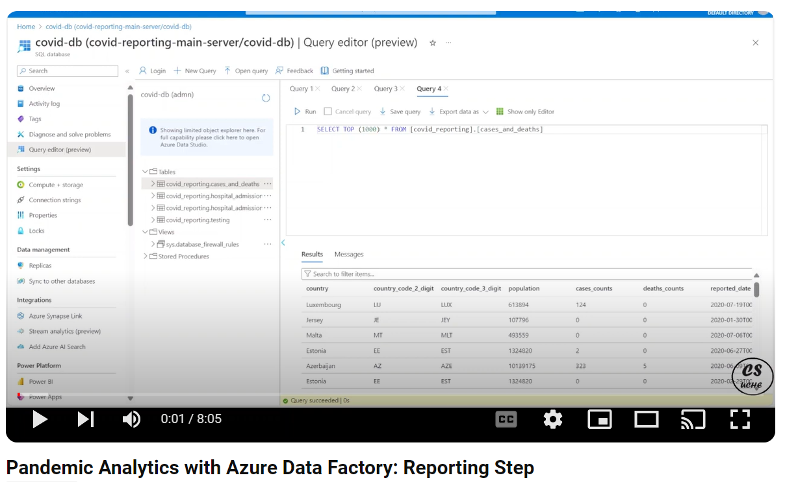

# Reporting: Unveiling COVID-19 Data Trend
Welcome to the reporting section of our Pandemic Analytics Project. Here we outline the steps to effectively aggregate, analyze, and report COVID-19 data trends using industry-standard tools and methodologies.

# Steps to Insight
Let's dive into our systematic approach, ensuring a seamless flow from raw data to actionable insights:

1. **Structuring The Data**
   - *Schema Creation*: Utilize SQL Server Management Studio (SSMS) to architect a robust data structure. This involves employing Data Definition Language (DDL) commands to define the schema, ensuring precision and clarity in organizing our data.
   - *Data Transfer*: Employ Azure Data Factory for swift and reliable data migration to our data lake.

2. **Trends Reporting**  
   - *Querying and Interacting*: Navigate and extract insights using SSMS from our Azure SQL database.
   - *Connecting with Power BI*: Merge data seamlessly with Power BI for intuitive visualization.
   - *Report Generation*: Craft engaging reports using Power BI, showcasing impactful trends and patterns.
   - *Sharing Insights*: Collaborate effectively by sharing reports, empowering informed decision-making.

3. **Monitoring and Alerts**  
   - *Alerts*: Stay proactive with email notifications for pipeline errors, ensuring uninterrupted operations.
   - *Dashboards*: Gain real-time insights through interactive dashboards:
       - Azure Monitor Dashboard: Dive into individual Data Factory performance for quick assessments.
       - Azure Analytics Workspace: Gain a holistic view across multiple Data Factories, enhancing monitoring capabilities.

# Demo: Bringing Data to Life

## Structuring the Data
Behind every insightful report lies a robust data infrastructure. Witness the journey from raw data to structured insights, facilitated by our reliable data pipeline and SSMS.

- [Data Definition Script](./data_factory_create_sql_tables.sql)
- Data Pipeline to transfer the cases and deaths data to an SQL database

- SSMS View top 10 Cases and Deaths Data

## Trend Reporting
Experience the power of data visualization as we dissect COVID-19 trends, shedding light on crucial patterns and insights.

## Monitoring
Ensuring the resilience of our data platform is paramount. Join us as we explore proactive monitoring strategies, featuring alerts and dynamic dashboards.
- Data Factory 30 days Pipeline Dashboard

- Private Dashboard with Diagnostic Analytics

- Log Analytics
   - 
   - [pdf workbook](./Azure_workbook.pdf)

## Demo Reporting Video

Stay tuned for more updates and insights from our Pandemic Analytics Project! Join us as we navigate the complexities of COVID-19 data reporting, transforming information into actionable intelligence.