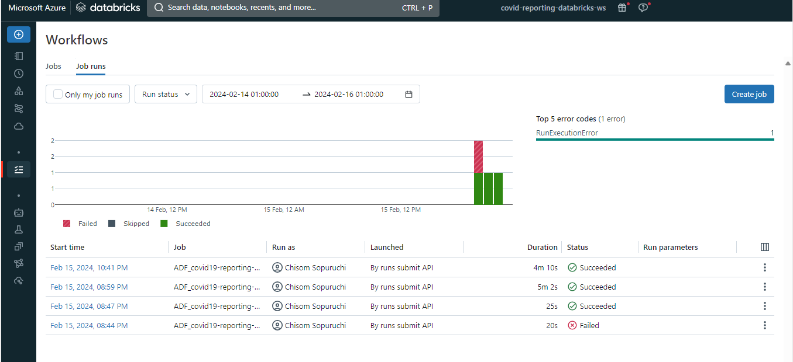
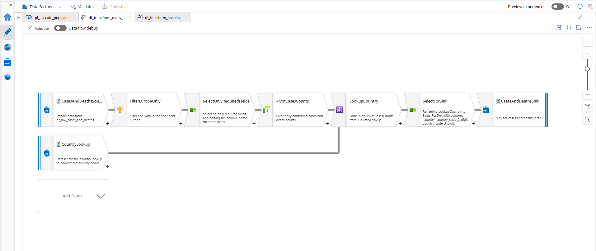
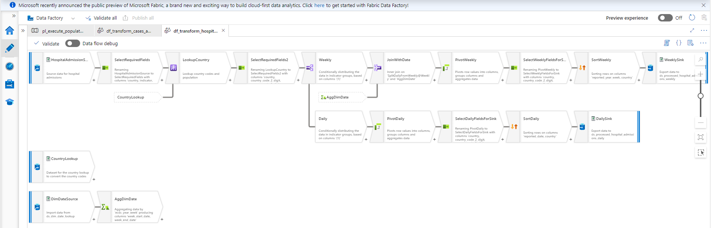

# Data Transformation

Data transformation is a pivotal stage involving the structuring and cleansing of data to ensure its suitability for analysis and reporting. 

In this project we have selected certian Azure tools renowned for their efficiency in handling big data through distributed computing. Big Data typically refers to data that meets the 5 Vs - Volume, Variety, Veracity, Velocity, and Value(which evolve as our understanding of the characteristics of big data improves).

Tools Used:
1. **Data Flow (Azure Data Factory)**: A user-friendly GUI tool for simple transformations, supporting distributed computing.
    * Description: Azure Data Factory's Data Flow offers a user-friendly GUI tool tailored for simplifying data transformations.
    * Features: It supports distributed computing, enabling seamless processing of large datasets across clusters.
    * Use Case: Ideal for straightforward transformations and data cleansing tasks, providing an intuitive interface for data engineers and analysts.
2. **HDInsight**: Specifically chosen for its efficiency in handling complex transformations with SQL-like compatibility and support for one of the Spark-supported languages, benefiting from distributed computing capabilities.
    * Description: HDInsight is a cloud-based managed service provided by Microsoft Azure, built upon open-source Apache Hadoop and related technologies. HDInsight is specifically chosen for its prowess in handling complex data transformations. 
    * Features: It offers SQL-like compatibility and supports one of the languages supported by Apache Spark.
    * Advantages: Leveraging distributed computing capabilities, HDInsight efficiently processes vast volumes of data, making it suitable for intricate transformation operations.
3. **Databricks**: Selected for its efficiency in complex transformations and support for one of the Spark-supported languages, enabling distributed computing.
    * Description: Databricks is a versatile tool renowned for its efficiency in handling complex data transformations.
    * Features: With support for one of the Spark-supported languages, Databricks empowers users with advanced capabilities for data manipulation.
    * Advantages: Its distributed computing capabilities enable fast and scalable processing of data, making it an excellent choice for sophisticated transformation tasks.

## Demo
**Databricks**

**Data Flow**

**HDInsights**